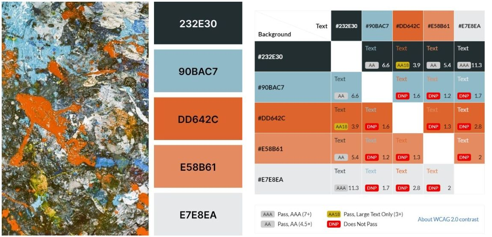

# Welcome to Art History Quiz
This fun Quiz provides users with a fun way of testing their knowledge of famous Art History paintings. Here, one can not only test their knowledge, but also learn some interesting facts about the art and artist in question. The Quiz is targeted at secondary school students, aspiring art historians and anyone intersted in art history.

***

***(Designed by Iryna Walsh)***

## [Play the Art History Quiz](https://kirynaw.github.io/art-history-quiz/)

## Table of Contents:
1. [**Exploration Phase**](#exploration-phase)
    * [***User Experience(UX)***](#user-experienceux)
      * [*User Stories*](#user-stories)
      * [*Goals*](#goals)
    * [***User Interface(UX)***](#user-interfaceui)
      * [*Wireframes*](#wireframes)
      * [*Color Scheme*](#color-scheme)
      * [*Typography*](#typography)
2. [**Implementation Phase**](#implementation-phase)
    * [***Quiz Features***](#quiz-features)
      * [*Current Features*](#current-features)
      * [*Possible Future Features*](#possible-future-deatures)
3. [**Testing Phase**](#testing-phase)
4. [**Deployment**](#deployment)
5. [**Credits**](#credits)
    * [**Languages Used**](#languages-used)
    * [**Technologies Used**](#tchnologies-used)
    * [***Code***](#code)
    * [***Content***](#content)
    * [***Media***](#media)
    * [***Acknowledgements***](#acknowledgements)

***

## **Exploration Phase:**
Who doesnt like a good quiz to test their knowlege on one or another topic. 
### **User Experience(UX)**
***The Users :***  
***The Purpose of the Quiz :*** 
### *User Stories:*
  |No.|Story|
  |---|-----|
  |1|**As a new visitor**,   I want to be able to|
  |2|**As an fine-art history novice**,   I want to be able to|
  |3|**As an fine-art history novice**,   I want to be able to|
  |4|**As a fine-art student**,   I want to be able to|
  |5|**As a fine-art student**,   I want to be able to|
  |6|**As a fine-art history amateur**,   I want to be able to|
  |7|**As a fine-art history amateur**,   I want to be able to|
### *Goals:*
### **User Interface(UI)**
#### *Wireframes:*
The quiz is responsive on all screen types: Phones, Tablets and Laptops.
- __Mobile Screen view and all featured described:__

  

- __IPad Screen View:__

  

- __Laptop Screen View:__

  

#### *Color Scheme:*
This color palette was generated from [Coolors](https://coolors.co/)
  
#### *Typography:*
## **Implementation Phase:**
## **Quiz features**
### **Current Features**
### **Possible Future Deatures**
## **Testing Phase:**
## **Deployment:**
## **Credits:**
### **Languages Used**
### **Technologies Used**
### **Code**
### **Content**
### **Media**
### **Acknowledgements**

        
