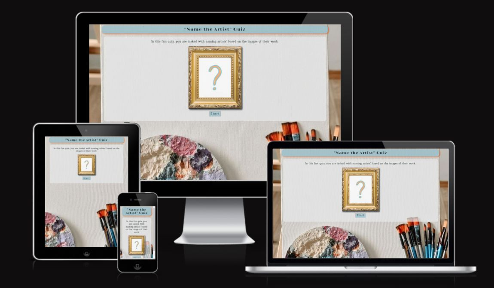
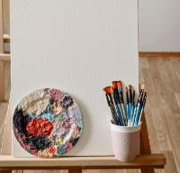
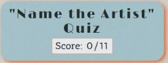
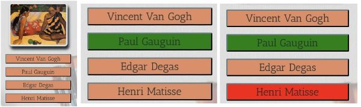
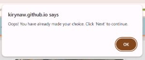

# Welcome to Art History Quiz 
This fun Quiz provides users with a fun way of testing their knowledge of famous Art History paintings of 17-20 century. Here, one can not only test their knowledge, but also learn some interesting facts about the art and artist in question. The Quiz is targeted at students, aspiring art historians and anyone interested in art history. 

*** 

***(Designed by Iryna Walsh)*** 

 
## [Play the Art History Quiz](https://kirynaw.github.io/art-history-quiz/) 

## Table of Contents: 
1. [**Exploration Phase**](#exploration-phase) 
    * [***User Experience(UX)***](#user-experienceux) 
      * [*Goals*](#goals) 
      * [*User Stories*](#user-stories) 
    * [***User Interface(UX)***](#user-interfaceui) 
      * [*Wireframes*](#wireframes) 
      * [*Color Scheme*](#color-scheme) 
      * [*Typography*](#typography) 
2. [**Implementation Phase**](#implementation-phase) 
    * [***Current Quiz Features***](#current-quiz-features) 
      * [*Landing Section*](#landing-section) 
      * [*Game Section*](#game-section) 
      * [*Game End Section](#game-end-section) 
    * [***Possible Future Features***](#possible-future-features) 
3. [**Testing Phase**](#testing-phase) 
4. [**Deployment**](#deployment) 
5. [**Credits**](#credits) 
    * [**Languages Used**](#languages-used) 
    * [**Technologies Used**](#tchnologies-used) 
    * [***Code***](#code) 
    * [***Content***](#content) 
    * [***Media***](#media) 
    * [***Acknowledgements***](#acknowledgements) 

*** 

## **Exploration Phase:** 
Who does not like a good quiz to test their knowledge on a random topic? Generic Quiz games have an ability to engage a wide demographic, from a school student to one's grandmother. 

While digital technology continues to reshape human interactions with art, quiz games have emerged as a popular method for engaging audiences in the exploration of artistic knowledge.  

In the exploration stage of the game development, we approached a variety of people, of different ages and vocations; a secondary school student studying art, an art college graduate, a senior software developer, a housewife and a retired mechanical engineer. We showed them a selection of historical fine art paintings and asked them to either name the art movement or the artist who created it. Surprisingly, our participants showed a lot more knowledge than anticipated; while the students who studied art exhibited greater knowledge of the subject, those with no background in art had some knowledge of almost every image shown.  

Thus, the conclusion was made that many must have a basic knowledge in art history; having acquired it in school or from attending museum as entertainment, and as long as the game is simple enough, it can be accessible and experienced by many demographics and also offer extra information to those who like to learn.  

### **User Experience(UX)** 
***The Users :***   
- The target audience for this quiz are secondary school students studying art-history, fine-art college students, users interested in interactive quizzes, fine-art history novices and amateurs and anyone who likes a visually engaging quiz challenge. 

***The Purpose of the Quiz :***  
- To provide users with a fun and interactive way of testing their knowledge of fine-art history of the 17-20 century. 

#### **Goals:**
***User Goal:*** 
 - *A Chance Visitors:* to experience a visually stimulating and entertaining interactive quiz game while learning interesting art history facts.  
 - *Fine-Art Students:* to test their knowledge in fine-art history, specifically the 17-20 century art and their creators, while comparing their current knowledge to the information presented.  
 - *Fine-Art History Amateurs:* to enjoy the visual experience while testing their current knowledge and learning new facts about a selection of 17-20 century fine-art paintings. 

***Site Owner Goal :*** 
 - The owner of the Quiz site is a fine-art graduate, who loves art-history and plans to create different types of art-quizzes available for students, novices and art-history enthusiasts who enjoy art and want to test their knowledge, learn more about art-history while experiencing an entertaining and visually stimulating quiz game. 

#### **User Stories:** 
  |No.|Story   | 
  |-  |--------| 
  |1  |**As a chance visitor**,   I want to be able to understand the aim of the quiz from the landing page and experience a simple interactive and visually engaging game.    **I know I can do it when the directions are clear, visually engaging and the game is well organized and not cluttered.**| 
  |2|**As a chance visitor**   I want to experience a user-friendly interface and clear navigation highlighting the quiz options; also ensuring that I can repeat the quiz easily to improve my score.   **I know I can do it when the site has visually ordered graphics, with all the buttons responding to the mouse cursor pointing at them and a button in the end of the quiz that lets you repeat the game.**| 
  |3|**As an fine-art history novice**,   I want to be able to participate in a quiz that gives you extra information on the art topic in question, to gain more knowledge    **I know I can do it when there is a section in the game that pops up, presenting more information about the artist and their art.**| 
  |4|**As a fine-art history novice**,   I want to be able to see instant feedback on the answers, to know which is right and wrong    **I can experience it when the correct answer button is chosen, it changes visually to indicate it is right and if the wrong answer is chosen it visually indicates its wrong and shows the correct one**| 
  |5|**As a fine-art student**,   I want to engage in a quiz that incorporates images of artworks and artists, allowing for visual recognition and engagement.   **I know I can do it when the quiz is mostly visual and uses images of art work in the body of the game instead of written questions.**| 
  |6|**As a fine-art student**,   I want to be able test my knowledge, see my progress throughout the quiz and receive an evaluation on my performance in the end.    **I know I can do it, when there is a score tracker visible throughout the game and at the end of the quiz, I can see how much I scored out of total and text feedback grading my performance.**| 

### **User Interface(UI)** 
Art History Quiz site comprises of three sections, each activated when a specific button is triggered. 

- **Landing Section :** 
  - This section introduces the quiz and gives instructions explaining the task and aim of the game to the user.  
  - Its aim is not only to introduce but visually entice the user to play the quiz game. 

- **Game Section :** 
  - This section contains the game board in its entirety. It consists of a heading section with the name of the quiz and reveals a score box; the main section contains 11 historically famous paintings, with four option buttons.  
  - Some features are disguised and revealed when a selection is made and give instant feedback on whether the selection is right or wrong. 

- **Game End Section :** 
  - This section consists of a heading that only shows the name of the quiz; and a main section notifying the user that they reached the end of the quiz with a final score number and a message that changes depending on the score acquired. 
  - It also provides the user with a button option to play again. 

#### **Wireframes:** 
The quiz is responsive on all screen types: Mobiles, Tablets and Laptops. 

  - __Mobile Screen view and all featured described:__ 
    

  - __IPad Screen View:__ 
     

  - __Laptop Screen View:__ 
     

#### **Color Scheme:** 
- The color scheme for the quiz was inspired by art museums and painting palettes with bright contrasting blues and oranges. This theme reflects the theme of the quiz. 
   &nbsp;&nbsp;&nbsp;&nbsp;
      
- These colors are rejuvinating and instill a sense of refreshment, which is very fitting to the setting of the art quiz. Oranges and light blue are complementary to each other, while grey, white and dark grey, add accent and contrast. 
- This palette with a selection of colors was manually generated using [Coolors](https://coolors.co/)
- The pallet was then scored on contrast levels on [Contrast Grid](https://contrast-grid.eightshapes.com/); to make sure that the color combinations are not clashing and are suitable to use for accessibility purposes.
   
   
#### **Typography:**
The fonts were taken from [Google Fonts](https://fonts.google.com/)
  - These fonts are easy to read and are fitting with the theme of the quiz.
  - For the header(h1) of the quiz "Limelight" font was used, and for the body headings (h2, h3, h4) and paragraphs the "Antic Slab" font was used.
     

*** 

## **Implementation Phase:** 
### **Current Quiz Features** 
#### **Landing Section** 
- It comprises of a heading section that contains the name of the quiz; main section, with an image, visually depicting the quiz; and a "Start" button, that triggers the **Game Section**. 

  &nbsp;&nbsp;------->&nbsp;&nbsp; 
   

#### **Game Section** 
- The main section overview, displaying responsiveness on all screen sizes, featuring the standard Laptop, Tablet and Smartphone screens. 

   
  &nbsp;&nbsp;------->&nbsp;&nbsp; 

   

  &nbsp;&nbsp;-------->&nbsp;&nbsp; 

  &nbsp;&nbsp;------->&nbsp;&nbsp; 

  &nbsp;&nbsp;------->&nbsp;&nbsp; 

- When the selected answer is correct, the button turns green; but if selected answer is incorrect, the button turns red, and the correct answer is also revealed in green. 

   

- The selection of an answer option also reveals a "Next" button and an "Interesting Facts" paragraph. 

  &nbsp;&nbsp;------->&nbsp;&nbsp; 

  &nbsp;&nbsp;------->&nbsp;&nbsp; 

- When "Next" button is clicked, it shows the next question/painting and hides the "Next" button and "Interesting Facts" paragraph. 

  &nbsp;&nbsp;------->&nbsp;&nbsp; 

   

- The process repeats until all 11 paintings are named and the final "Next" button reveals the **Game End Section**. 

#### **Game End Section** 

  &nbsp;&nbsp;------->&nbsp;&nbsp; 

   

   

- At the bottom of the **Game End Section** there is a "Play Again" button that allows the user to try to play again; when clicked, it brings the user back to the **Game Section**. 

  &nbsp;&nbsp;------->&nbsp;&nbsp; 

### **Possible Future Features** 
**Online Presence** 
- Create a sign-up section on the landing page so players can create an account or log in using social media.  
- Enable players to invite friends to challenge their scores or compete in real-time quizzes. 

**Quiz Theme Variety** 
- Create several types of art quizzes that can be selected from the landing page; verbal quizzes and image based; covering topics such as art movements, design history, 21 century art, art techniques, design techniques, etc. 

**Internal Features** 
- When the quiz is completed, provide links to articles or videos related to the topics covered; located at the quiz end section, so the user can learn more and dive deeper into areas of interest after receiving their score. 
- Give option to take the quiz with a timer to stimulate exam environment  
- Create a section with testimonials from other users to build trust and encourage participation. 

**Other Advancements** 
- Use an obfuscator tool to disguise the code that can identify answers to the quiz questions to prevent the user from cheating. 
- Add 20+ question arrays, and only loop through random 10 of them, so every time a user does the quiz again, they get different selection of questions. 
- Create a json file to store objects data. 

*** 

## **Testing Phase:** 
The Testing Phase Content is available in a separate document file that can be accessed at [TESTING.md](TESTING.md) 

*** 

## **Deployment:** 
### **Remote Deployment** 
The following steps were taken to deploy the website to GitHub pages: 
  1. Log in to [GitHub](https://github.com/) 
  2. Use navigation to locate [KIrynaW/art-history-quiz](https://github.com/KIrynaW/art-history-quiz) in *"Your Repositories"*. 
  3. In the selected repository press the *"Settings"* tab. 
  4. On the left-hand side, press the *"Pages"* tab. 
  5. Locate the **"Source"** section and make sure it is set to "Deploy from Branch". 
  6. Next, under the **"Branch"** section, extend the drop-down list and select "Main". 
  7. The page then automatically updates, confirms successful deployment and displays a link to the website. 
  A live link to the website can be found here: [Name The Artist Quiz](https://kirynaw.github.io/art-history-quiz/) 

### **Clone** 
1. Go to the chosen repository. 
2. Click on the "Code" green button on the top-ride side of the page. 
3. Select and Copy the HTTP (URL) 
4. Open the Git Terminal; change the current directory to the desired one where the cloned directory is to be placed. 
5. Input 'git clone' and after it the URL that was copied to look as following *git clone https://github.com/username/repository/* 
6. Click "Enter" to create a clone. 

### **Fork** 
1. Log in to [GitHub](https://github.com/) 
2. Use navigation to locate [KIrynaW/art-history-quiz](https://github.com/KIrynaW/art-history-quiz) repository. 
3. In the top right corner of the page, locate "Fork" and click on it. 
4. In the "Repository Name" input window, create a new name that is different to the current or you can choose to keep the original. 
5. You can create a description of your Fork 
6. Scroll to the bottom of the page; in the bottom-right corner, click "Create Fork". 

*** 

## **Credits:** 
### **Languages Used** 
- [HTML5](https://en.wikipedia.org/wiki/HTML5) 
- [CSS](https://en.wikipedia.org/wiki/CSS) 
- [JavaScript](https://en.wikipedia.org/wiki/JavaScript) 

### **Technologies Used** 
- [GitHub](https://github.com/) - used to create, store and save the quiz building components. 
- [Git](https://git-scm.com/) - used for version control in the GitPod Terminal to Add, Commit and Push the code to GitHub 
- [Google Fonts](https://fonts.google.com/) - used their fonts in the quiz. 
- [Favicon](https://favicon.io/) - used their favicons on the website. 
- [Font Awesome](https://fontawesome.com/) - used their free icons in the quiz. 
- [Balsamiq](https://balsamiq.com/) - used to create the wireframes. 
- [Birme](https://www.birme.net/) - used to resize the images and format into .webp files. 
- [Coolors](https://coolors.co/) - used to generate the color scheme for the website. 
- [PineTools](https://pinetools.com/) - used to merge the photos for README. 
- [Wave](https://wave.webaim.org/) - to check the performance on web accessibility evaluation tool 
- [LightHouse Google Extension](https://chromewebstore.google.com/detail/lighthouse/blipmdconlkpinefehnmjammfjpmpbjk?hl=en) - this Chrome Dev Tools was used to scan and generate performance statistics of the quiz 
- [W3C Markup Validator](https://validator.w3.org/) - the HTML code was run through to check errors and validate 
- [Jigsaw CSS Validator](https://jigsaw.w3.org/css-validator/) - the CSS code was run through to check errors and validate 
- [Jshint JavaScript Validator](https://jshint.com/) - the JavaScript code was run through to check errors and validate 
- [DeepScan Extension](https://deepscan.io/dashboard/) - was used to perform a deep check of the whole site to evaluate overall performance 
- [Am I Responsive?](https://ui.dev/amiresponsive) - used to check for responsiveness across variety of screen sizes 

### **Code** 
- The quiz HTML and CSS code is completely original and was inspired by developer's background in art. 
- The [FreeCodeCamp](https://www.freecodecamp.org/) was consulted for the tutorial on how to shuffle through the array in JavaScript file by using [Fisher-Yates Sorting Algorithm code](https://www.freecodecamp.org/news/how-to-shuffle-an-array-of-items-using-javascript-or-typescript/) 
- The JavaScript code is mostly original, apart from using the "Fisher-Yates Algorithm" mentioned above; the rest was created through trial, error and consultation with the [Code Institute's](https://codeinstitute.net/ie/) course material, the [W3School](https://www.w3schools.com/js/default.asp), [Stack Overflow](https://stackoverflow.com/) 

### **Content** 
The content for paintings facts, was taken from [Wikipedia articles on each artist](https://www.wikipedia.org/) articles and then modified and rephrased.  
Sections of original content are also present on the website. 

### **Media** 
  Background Image:  
  [Photo by Bade Saba: a white easel with paint brushes and a canvas](https://www.pexels.com/photo/a-white-easel-with-paint-brushes-and-a-canvas-15405967/) 

  Color Scheme:  
  [Photo by Sen Sen: abstract colorful painting](https://www.pexels.com/photo/abstract-colorful-painting-9902153/) 

  Landing page image:  
  [Image by freepik: golden frame](https://www.freepik.com/free-photo/copy-space-canvas-golden-frame-paint_9977242.htm#fromView=search&page=12&position=1&uuid=d41551d9-4e6a-4919-a0cd-d8988533d775/)  
  [Image by rawpixel.com on Freepik: question mark](https://www.freepik.com/free-vector/question-mark-vector-hand-drawn-typography_33112898.htm#fromView=search&page=2&position=12&uuid=edd6bd37-cf77-4a98-b3bd-ca84881eea93/) 

  Images of the paintings:  
  [WikiArt: Fruit by Alphonse Mucha](https://www.wikiart.org/en/alphonse-mucha/fruit-1897#)  
  [WikiArt: Blue Nude II by Henri Matisse](https://www.wikiart.org/en/henri-matisse/blue-nude-1952)  
  [WikiArt: What's New? by Paul Gauguin](https://www.wikiart.org/en/paul-gauguin/what-s-new-1892)  
  [WikiArt: Campbell's Soup Can (onion) by Andy Warhol ](https://www.wikiart.org/en/andy-warhol/campbell-s-soup-can-onion)  
  [WikiArt: A Bar at the Folies-Bergere by Edouard Manet](https://www.wikiart.org/en/edouard-manet/a-bar-at-the-folies-bergere-1882-1)  
  [WikiArt: Portrait of Dora Maar by Pablo Picasso ](https://www.wikiart.org/en/pablo-picasso/portrait-of-dora-maar-1937-1)  
  [WikiArt: Composition IV by Wassily Kandinsky](https://www.wikiart.org/en/wassily-kandinsky/composition-iv-1911)  
  [WikiArt: The Girl with a Pearl Earring by Johannes Vermeer ](https://www.wikiart.org/en/johannes-vermeer/the-girl-with-a-pearl-earring)  
  [WikiArt: Bathers at Asnières by Georges Seurat](https://www.wikiart.org/en/georges-seurat/bathers-at-asni-res-1884)  
  [WikiArt: Still Life - Vase with Fifteen Sunflowers by Vincent van Gogh](https://www.wikiart.org/en/vincent-van-gogh/still-life-vase-with-fifteen-sunflowers-1888-1)  
  [WikiArt: The Persistence of Memory by Salvador Dali](https://www.wikiart.org/en/salvador-dali/the-persistence-of-memory-1931)  

### **Acknowledgements** 
- I would like to give special appreciation to my husband Chris Walsh for his support and extra guidance with this project. 
- I also want to thank my mentor Daniel Hamilton, for giving great resources, guiding, teaching and supporting me through this project. 
- Also would like to thank Code Institute for their dedication to their students, wonderful educational material and valuable resources.          