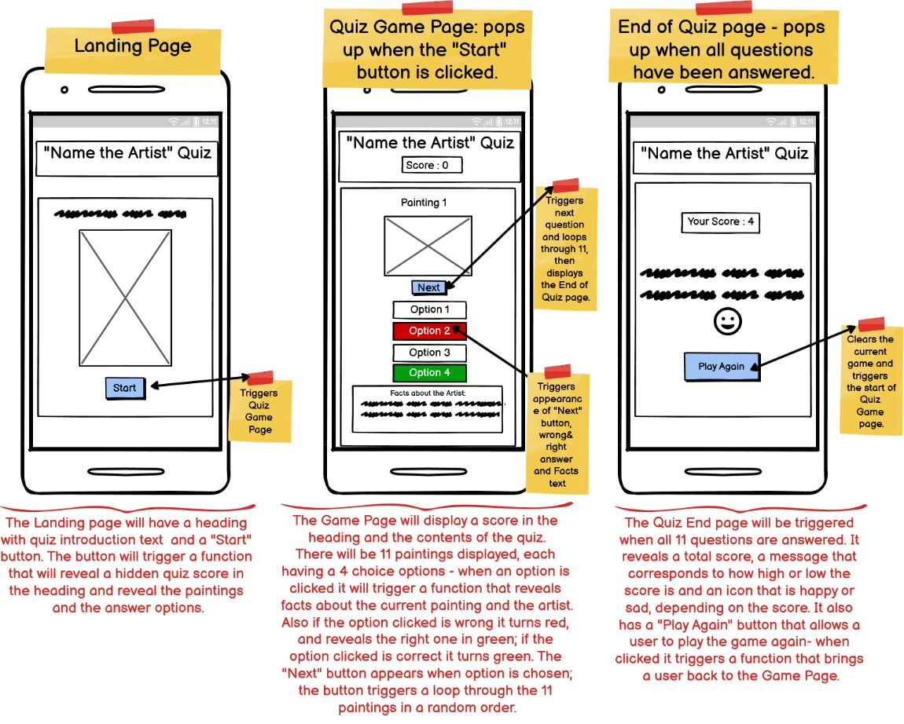

# Welcome to Art History Quiz
This fun Quiz provides users with a fun way of testing their knowledge of famous Art History paintings. Here, one can not only test their knowledge, but also learn some interesting facts about the art and artist in question. The Quiz is targeted at secondary school students, aspiring art historians and anyone intersted in art history.

***

***(Designed by Iryna Walsh)***

## [Play the Art History Quiz](https://kirynaw.github.io/art-history-quiz/)

## Table of Contents:
1. [**Exploration Phase**](#exploration-phase)
    * [***User Experience(UX)***](#user-experienceux)
      * [*Goals*](#goals)
      * [*User Stories*](#user-stories)
    * [***User Interface(UX)***](#user-interfaceui)
      * [*Wireframes*](#wireframes)
      * [*Color Scheme*](#color-scheme)
      * [*Typography*](#typography)
2. [**Implementation Phase**](#implementation-phase)
    * [***Quiz Features***](#quiz-features)
      * [*Current Features*](#current-features)
      * [*Possible Future Features*](#possible-future-deatures)
3. [**Testing Phase**](#testing-phase)
4. [**Deployment**](#deployment)
5. [**Credits**](#credits)
    * [**Languages Used**](#languages-used)
    * [**Technologies Used**](#tchnologies-used)
    * [***Code***](#code)
    * [***Content***](#content)
    * [***Media***](#media)
    * [***Acknowledgements***](#acknowledgements)

***

## **Exploration Phase:**
Who does not like a good quiz to test their knowlege on one or another topic. 
### **User Experience(UX)**
***The Users :***  
***The Purpose of the Quiz :*** 
### *Goals:*
- ***User Goal:***
  - *A Chance Visitors:* to experience a visualy stimulating and entertaining interactive quiz game while learning interesting art history facts. 
  - *Fine-Art Students:* to test their knowlege in fine-art history, specificaly the 17-21 century art and their creators, while comparing their current knowlege to the information presented. 
  - *Fine-Art History Amateurs:* to enjoy the visual experience while testing their current knowlege and learning new facts about a selection of 17-21 century fine-art paintings.
- ***Quiz Owner Goal :***
  - The owner of the Quiz site is a fine-art graduate, who loves art-history and plans to created different types of art-quizes available for students, novices and art-history enthusiasts who enjoy art and want to test their knowlege, learn more about art-history while experiencing an entertaining and visualy stimulating quiz game.
### *User Stories:*
  |No.|Story|
  |---|-----|
  |1|**As a new visitor**,   I want to be able to|
  |2|**As an fine-art history novice**,   I want to be able to|
  |3|**As an fine-art history novice**,   I want to be able to|
  |4|**As a fine-art student**,   I want to be able to|
  |5|**As a fine-art student**,   I want to be able to|
  |6|**As a fine-art history amateur**,   I want to be able to|
  |7|**As a fine-art history amateur**,   I want to be able to|
### **User Interface(UI)**
#### *Wireframes:*
The quiz is responsive on all screen types: Phones, Tablets and Laptops.
- __Mobile Screen view and all featured described:__

  

- __IPad Screen View:__

  

- __Laptop Screen View:__

  

#### *Color Scheme:*
This color palette was generated from [Coolors](https://coolors.co/)
  
#### *Typography:*
## **Implementation Phase:**
## **Quiz features**
### **Current Features**
### **Possible Future Deatures**
## **Testing Phase:**
The Testing Phase Content is available in a separate document file that can be accessed at [TESTING.md](TESTING.md)

## **Deployment:**
## **Credits:**
### **Languages Used**
### **Technologies Used**
### **Code**
### **Content**
### **Media**
### **Acknowledgements**

        
