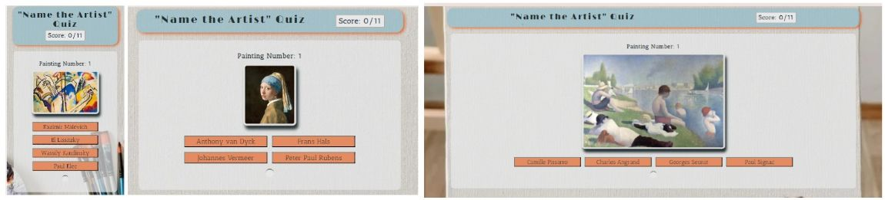

# Welcome to Art History Quiz
This fun Quiz provides users with a fun way of testing their knowledge of famous Art History paintings of 17-20 century. Here, one can not only test their knowledge, but also learn some interesting facts about the art and artist in question. The Quiz is targeted at students, aspiring art historians and anyone intersted in art history.

***

***(Designed by Iryna Walsh)***

## [Play the Art History Quiz](https://kirynaw.github.io/art-history-quiz/)

## Table of Contents:
1. [**Exploration Phase**](#exploration-phase)
    * [***User Experience(UX)***](#user-experienceux)
      * [*Goals*](#goals)
      * [*User Stories*](#user-stories)
    * [***User Interface(UX)***](#user-interfaceui)
      * [*Wireframes*](#wireframes)
      * [*Color Scheme*](#color-scheme)
      * [*Typography*](#typography)
2. [**Implementation Phase**](#implementation-phase)
    * [***Current Quiz Features***](#current-quiz-features)
      * [*Landing Section*](#landing-section)
      * [*Game Section*](#game-section)
      * [*Game End Section](#game-end-section)
    * [***Possible Future Features***](#possible-future-features)
3. [**Testing Phase**](#testing-phase)
4. [**Deployment**](#deployment)
5. [**Credits**](#credits)
    * [**Languages Used**](#languages-used)
    * [**Technologies Used**](#tchnologies-used)
    * [***Code***](#code)
    * [***Content***](#content)
    * [***Media***](#media)
    * [***Acknowledgements***](#acknowledgements)

***

## **Exploration Phase:**
Who does not like a good quiz to test their knowlege on a random topic? Generic Quiz games have an ability to engage a wide demographic, from a school student to one's grandmother.

While digital technology continues to reshape human interactions with art, quiz games have emerged as a popular method for engaging audiences in the exploration of artistic knowledge. 
In the exploration stage of the game development, we aproached a variet of people, of different ages and vocations; a secondary school student studying art, an art college graduate, a senior software developer, a housewife and a retired mechanical engeneer. We showed them a selection of historical fine art paintings and asked them to either name the art movement or the artist who created it. Surprisingly, our participants showed a lot more knowlege than antisipated; while the students who studied art, exhbited greater knowlege on the subgect, those with no background in art had some knowlege on almost every image shown. 
Thus the conclusion was made that many must have a basic knowlege in art history; having aquired it in school or from attending museum as enetratinment, and as long as the game is simple enough, it CAN be accessible and experienced by many demographics and also offer extra information to those who like to learn. 
### **User Experience(UX)**
***The Users :***  
- The target audience for this quiz are: secondary school students studing art-history, fine-art college students, users interested in interactive quizes, fine-art history novices and amateurs and anyone who like a visualy engaging quiz challage.

***The Purpose of the Quiz :*** 
- To provide users with a fun and interactive way of testing their knowlege in fine-art history of 17-20 century.

### *Goals:*
- ***User Goal:***
  - *A Chance Visitors:* to experience a visualy stimulating and entertaining interactive quiz game while learning interesting art history facts. 
  - *Fine-Art Students:* to test their knowlege in fine-art history, specificaly the 17-20 century art and their creators, while comparing their current knowlege to the information presented. 
  - *Fine-Art History Amateurs:* to enjoy the visual experience while testing their current knowlege and learning new facts about a selection of 17-20 century fine-art paintings.

- ***Site Owner Goal :***
  - The owner of the Quiz site is a fine-art graduate, who loves art-history and plans to created different types of art-quizes available for students, novices and art-history enthusiasts who enjoy art and want to test their knowlege, learn more about art-history while experiencing an entertaining and visualy stimulating quiz game.
### *User Stories:*
  |No.|Story|
  |------|--------|
  |1|**As a new visitor**,   I want to be able to understand the aim of the quiz from the landing page and experience a simple interactive and visualy engaging game.    **I know I can do it when the directions are clear, visualy engaing and the game is well organised and not cluttered.**|
  |2|**As a new visitor**,   I want to be experience clear navigation and user-friendly interface; ensuring that players of all ages can enjoy the game.  |
  |3|**As an fine-art history novice**,   I want to be able to particiape in a quiz that gives you extra information on the art topic in question, to gain more knowlege|
  |4|**As an fine-art history novice**,   I want to be able to receive instant feedback on the answers, to know which is right and wrong|
  |5|**As a fine-art student**,   I want to engage in a quiz that incorporates images of artworks and artists, allowing for visual recognition and engagement.|
  |6|**As a fine-art student**,   I want to be able to receive a comment on my performance in the art quiz|
  |7|**As a fine-art history amateur**,   I want to be able test my knowledge, discover new artists, and improve my appreciation of art.|
  |8|**As a fine-art history amateur**,   I want to be able to track my progress and the score throughout the quiz, with a final score tallied|

### **User Interface(UI)**
Art History Quiz site comprises of three sections, each activated when a specific button is triggered.

- **Landing Section :**
  - This section introduces the quiz and gives instruction explaining the task and aim of the game to the user. 
  - It's aim is not only to introduce but visually entise the user to play the quiz game.

- **Game Section :**
  - This section contains the game board in it's entirty. It consists of a heading section with the name of the quiz and reveals a score box; the main section contains 11 historicaly famous paintings, with four option buttons. 
  - Some features are disguised and revealed when a selection is made and give instant feedback on whether the selection is right or wrong.

- **Game End Section :**
  - This section consists of a heading that only shows the name of the quiz; and a main section notifying the user that they reached the end of the quiz with a final score number and a message that changes depending on the score aquired.
  - It also provides the user with a button option to play again.
  
#### **Wireframes:**
The quiz is responsive on all screen types: Mobiles, Tablets and Laptops.

  - __Mobile Screen view and all featured described:__

    

  - __IPad Screen View:__

    

  - __Laptop Screen View:__

    

#### **Color Scheme:**
 - This color palette was generated from [Coolors](https://coolors.co/)

    
#### **Typography:**
- Fonts used
    

***

## **Implementation Phase:**
### **Current Quiz Features**
#### **Landing Section**
- It comprises of a heading section that contains the name of the quiz; main section, with an image, visualy depicting the quiz; and a "Start" button, that triggers the **Game Section**.

  
  

#### **Game Section**
- The main section overview, displaying responsivnes on all screen sizes, featuring the standard Laptop, Tablet and Smartphone screens.

  
  

  
  

- When the selected answer is correct, the button turns green; but if selected answer is incorrect, the button turns red and the correct answer is also revealed in green.

  

- The selection of an answer option also reveals a "Next" button and a "Interesting Facts" paragraph.

  

- When "Next" button is clicked, it shows the next question/painting and hides the "Next" button and "Interesting Facts" paragraph.

  
    
- The process repeats until all 11 painting are named and the final "Next" button reveals the **Game End Section**.

#### **Game End Section**
  
  

- At the bottom of the **Game End Section** there is a "Play Again" button that allows the user to try to play again; when clicked, it bring the user back to the **Game Section**.

  
 
### **Possible Future Features**

***

## **Testing Phase:**
The Testing Phase Content is available in a separate document file that can be accessed at [TESTING.md](TESTING.md)

***

## **Deployment:**
### **Remote Deployment**
The following steps were take to deploy the website to GitHub pages:
  1. Log in to [GitHub](https://github.com/)
  2. Use navigation to locate [KIrynaW/art-history-quiz](https://github.com/KIrynaW/art-history-quiz) in *"Your Repositories"*.
  3. In the selected repository press the *"Settings"* tab.
  4. On the left hand side, press the *"Pages"* tab.
  5. Locate the **"Source"** section and make sure it is set to "Deploy from Branch".
  6. Next, under the **"Branch"** section, extend the drop-down list and select "Main".
  7. The page then automatically updates, confirms successful deployment and displays a link to the website.

  A live link to the website can be found here: [Name The Artist Quiz](https://kirynaw.github.io/art-history-quiz/)

### **Clone**

### **Fork**
1. Log in to [GitHub](https://github.com/)
2. Use navigation to locate [KIrynaW/art-history-quiz](https://github.com/KIrynaW/art-history-quiz) repository.
3. In the right-top corner of the page, locate "Fork" and click on it.
4. In the "Repository Name" input window, create a new name that is different to the current or you can choose to keep the original.
5. You can create a description of your Fork
6. Scroll to the bottom of the page; in the bottom-right corner, click "Create Fork".

***

## **Credits:**
### **Languages Used**
- [HTML5](https://en.wikipedia.org/wiki/HTML5)
- [CSS](https://en.wikipedia.org/wiki/CSS)
- [JavaScript](https://en.wikipedia.org/wiki/JavaScript)

### **Technologies Used**
- [GitHub](https://github.com/) - used to create, store and save the quiz building components.
- [Git](https://git-scm.com/) - used for version control in the GitPod Terminal to Add, Commit and Push the code to GitHub
- [Google Fonts](https://fonts.google.com/) - used their fonts in the quiz.
- [Favicon](https://favicon.io/) - used their favicons in the website.
- [Font Awesome](https://fontawesome.com/) - used their free icons in the quiz.
- [Balsamiq](https://balsamiq.com/) - used to create the wireframes.
- [Birme](https://www.birme.net/) - used to resize the images and format into .webp files.
- [Coolors](https://coolors.co/) - used to generate the colorscheme for the website.
- [PineTools](https://pinetools.com/) - used to merge the photos for README.
- [Wave](https://wave.webaim.org/) - to check the performance on web accessibility evaluation tool
- [LightHouse Google Extension](https://chromewebstore.google.com/detail/lighthouse/blipmdconlkpinefehnmjammfjpmpbjk?hl=en) - this Chrome Dev Tools was used to scan and generate performance statistics of the quiz
- [W3C Markup Validator](https://validator.w3.org/) - the HTML code was run through to check errors and validate
- [Jigsaw CSS Validator](https://jigsaw.w3.org/css-validator/) - the CSS code was run through to check errors and validate
- [Jshint JavaScript Validator](https://jshint.com/) - the JavaScript code was run through to check errors and validate
- [DeepScan Extension](https://deepscan.io/dashboard/) - was used to perform a deep check of the whole webiste to evaluate overall performance
- [Am I Responsive?](https://ui.dev/amiresponsive) - used to check for responsivness across variety of screen sizes

### **Code**
- The quiz HTML and CSS code is completly original and was inspired by developer's background in art.
- The [FreeCodeCamp](https://www.freecodecamp.org/) was consulted for the tutorial on how to shuffle through the array in JavaScript file by using [Fisher-Yates Sorting Algorithm code](https://www.freecodecamp.org/news/how-to-shuffle-an-array-of-items-using-javascript-or-typescript/)
- The JavaScript code is mostly original, apart from using the "Fisher-Yates Algorithm" mentioned above; the rest was created through trial, error and consultation with the [Code Institute's](https://codeinstitute.net/ie/) course material, the [W3School](https://www.w3schools.com/js/default.asp), [Stack Overflow](https://stackoverflow.com/)

### **Content**
The content for paintings facts, was taken from [Wikipedia articles on each artist](https://www.wikipedia.org/) articles and then modified and rephrased. 
Sections of original content are also present in the website.

### **Media**
  Backround Image: 
  [Photo by Bade Saba: a white easel with paint brushes and a canvas](https://www.pexels.com/photo/a-white-easel-with-paint-brushes-and-a-canvas-15405967/)

  Color Scheme: 
  [Photo by Sen Sen: abstract colorful painting](https://www.pexels.com/photo/abstract-colorful-painting-9902153/)

  Landing page image: 
  [Image by freepik: golden frame](https://www.freepik.com/free-photo/copy-space-canvas-golden-frame-paint_9977242.htm#fromView=search&page=12&position=1&uuid=d41551d9-4e6a-4919-a0cd-d8988533d775/) 
  [Image by rawpixel.com on Freepik: question mark](https://www.freepik.com/free-vector/question-mark-vector-hand-drawn-typography_33112898.htm#fromView=search&page=2&position=12&uuid=edd6bd37-cf77-4a98-b3bd-ca84881eea93/)

  Images of the paintings: 
  [WikiArt: Fruit by Alphonse Mucha](https://www.wikiart.org/en/alphonse-mucha/fruit-1897#) 
  [WikiArt: Blue Nude II by Henri Matisse](https://www.wikiart.org/en/henri-matisse/blue-nude-1952) 
  [WikiArt: What's New? by Paul Gauguin](https://www.wikiart.org/en/paul-gauguin/what-s-new-1892) 
  [WikiArt: Campbell's Soup Can (onion) by Andy Warhol ](https://www.wikiart.org/en/andy-warhol/campbell-s-soup-can-onion) 
  [WikiArt: A Bar at the Folies-Bergere by Edouard Manet](https://www.wikiart.org/en/edouard-manet/a-bar-at-the-folies-bergere-1882-1) 
  [WikiArt: Portrait of Dora Maar by Pablo Picasso ](https://www.wikiart.org/en/pablo-picasso/portrait-of-dora-maar-1937-1) 
  [WikiArt: Composition IV by Wassily Kandinsky](https://www.wikiart.org/en/wassily-kandinsky/composition-iv-1911) 
  [WikiArt: The Girl with a Pearl Earring by Johannes Vermeer ](https://www.wikiart.org/en/johannes-vermeer/the-girl-with-a-pearl-earring) 
  [WikiArt: Bathers at Asnières by Georges Seurat](https://www.wikiart.org/en/georges-seurat/bathers-at-asni-res-1884) 
  [WikiArt: Still Life - Vase with Fifteen Sunflowers by Vincent van Gogh](https://www.wikiart.org/en/vincent-van-gogh/still-life-vase-with-fifteen-sunflowers-1888-1) 
  [WikiArt: The Persistence of Memory by Salvador Dali](https://www.wikiart.org/en/salvador-dali/the-persistence-of-memory-1931) 

### **Acknowledgements**
- I would like to give special apreciation to my husband Chris Walsh for his support and extra guidense with this project.
- I also want to thank my mentor Daniel Hamilton, for giving great resources, guiding, teaching and supporting me through this project.
- Also would like to thank Code Institute for their dedication to their students, wonderful educational material and valuable resources.

        
