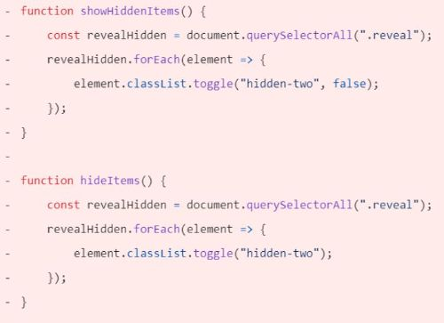

# Testing Page
## Table of Contents
 [**Testing Phase**](#testing-phase)
  * [***Bugs***](#bugs)
  * [***Validator Testing***](#validator-testing)
  * [***Accessibility Testing***](#accessibility-testing)
  * [***Manual Testing***](#manual-testing)
  * [***User Story Testing***](#user-story-testing)

## **Testing Phase:**
### **Bugs**
Bugs encountered during the development of the quiz:

  - HTML Bugs:
    - These errorss were encountered in the mid development of the quiz game:

      

    - The *Empty Heading* error was fixed by adding "Facts" text to the heading, which later was changed to a paragraph, as can be seen in the screenshot below.
    - Since the id of the paragrap is used to alter the message through Javascript, its contents are imperative, but needed to clear the error.

     &nbsp;&nbsp;------->&nbsp;&nbsp;

    - The *Empty Heading Error* was fixed by adding "Message" text to the heading.
    - Since the id of the heading is used to alter the message through Javascript, its contents are imperative, but needed to clear the error.

     &nbsp;&nbsp;------->&nbsp;&nbsp;

    - The *Child of Button Element Error* was fixed by removing the heading element from the text, and using the button class to style the text.
    
     &nbsp;&nbsp;------->&nbsp;&nbsp;

  - CSS Bugs:

    

    &nbsp;&nbsp;------->&nbsp;&nbsp;

  - JavaScript Bugs:
    
    Get Image Bug:

    
    
    

    &nbsp;&nbsp;------->&nbsp;&nbsp;

    Toggle Hidden Items challanges:

     Previous Code:

      

     Final Code refactor:

      

     Get facts function is the function that is triggered by the toggle of the button.

      

### **Validator Testing**
  The final validation testing was performed when all the previously encountered bugs were fixed, and the results were of a clean code, with not errors in its final stage.

  - W3C Markup Validation report of the quiz.

    

  - Jigsaw CSS Validation report of the quiz.

    

  - JSHint JavaScript Code quality report of the quiz.

    

### **Accessibility Testing:**
To check the quiz site *Performance*, *Accessibility*, *Best Practice* and *SEO*, it was run through the *Lighthouse* Chrome Dev Tools performance statistics generator *Wave* a web accessability tool, and *DeepScan* a Javascript code quality evaluator.
There were no errors detected and the quiz has an overall high performance.
 
 - Lighthouse Desktop Report
  

 - Lighthouse Mobile Report
  

 - Wave Report on the Quiz Site:
  

- DeepScan Report on the Quiz Site:
  
  
### **Manual Testing**
 **Browser Testing** 
  - Testing was conducted across three different web browsers; *Chrome*, *Edge* and *Firefox* to ensure that the quize site works correctly on differen browsers. 
    - No issues were detected.

 **Quiz Responsiveness**
 - Responsiveness of the quiz site was tested on various Phones, Tablets, Laptops and a Desktop to check for any issues. 
    - The results confirmed that the website is fully responsive across all device screens. 
 
 **Quiz Functions and Features Performance** 
|No.| Section    |Function               | Test                                 |Pass/Fail        |
|---|------------|-----------------------|--------------------------------------|-----------------|
| 1.|Quiz Landing| When the "Start" button is clicked, it reveals: the game play section with paintings to identify; four answer options; the score box and hides the landing section| Hover over the start button, it will highlight, and then press on it. *The assigned function executes*|Pass|
|2.|Quiz Game|When the answer option button, that is clicked, contains the correct answer, the function triggered increments 1 point to the score; if wrong, no points are added|Hover over any of the four buttons, they will highlight, and choose one of the options, then press. *The assigned function executes*|Pass| 
|3. |Quiz Game|When any of the four option buttons are clicked: the buttons disable, the right answer turns green and wrong red| Hover over any of the four buttons, they will highight, then make your choice by pressing on one of them. *The assigned function executes*|Pass|
|4. |Quiz Game|When any of the option buttons are clicked, they trigger a function that reveals the "Next" button and a "Facts" paragraph|Hover over any of the four buttons, they will highlight, then press on one of the buttons. *The assigned function executes*|Pass|  
|5. |Quiz Game|When any of the option buttons are clicked again after an answer was already selected, the alert message is triggered; this event is the same on every question| Hover over any of the four buttons after having chosen an option, they will not highlight, then press on one of the buttons.  *The assigned function executes*|Pass|
|6. |Quiz Game|When the "Next" button is clicked the function is triggered, that loops randomly through stored questions; clears previously triggered functions and performs the No.2,3,4,5 functions all over again|Hover over the "Next" button, it will highlight, and press on it. *The assigned function executes*|Pass|
|7. |Quiz Game|When the 11th image in the array is reached and the "Next" button is clicked, the function condition is triggered that reveals the End Quiz Section; hides the other sections; removes the score box from heading; reveals the final score in the main section, a message and "Start Again" button|Hover over the "Next" button, it will highlight, and press on it.  *The assigned function executes.*|Pass|
|8. |Quiz End|If the final score is 3-4 points, the message is "Not Great! Maybe try again?" with sad smiley icon; if 5-8 points, the message is "Well Done! You have some knowlege in Art History" with a smiling smiley icon; if 9-10 points, the message is "Excellent! You know your Art History well.", with happy smiley icon; if 11 points, the message is "Outstanding! You are an Art History Master." with very a happy smiley icon| Go through the whole quiz and choose the names of all the 11 painting creators to reach the End Quiz Section.  *The assigned function exectutes.*|Pass|
|9. |Quiz End|When the "Play Again" button is clicked, it triggers the function that takes the user to the Quiz Game Section; it clears the score box and image index value to initial and restarts the loop function|Hover over the "Start Again" button, it will highlight, then press on it.  *The assigned function executes*.|Pass|

### **User Story Testing**
|No.|Result|Evidence                                                             |
|---|------|---------------------------------------------------------------------|
|1  |      |**As a new visitor**,   I want to be able to                      |
|2  |      |**As an fine-art history novice**,   I want to be able to         |
|3  |      |**As an fine-art history novice**,   I want to be able to         |
|4  |      |**As a fine-art student**,   I want to be able to                 |
|5  |      |**As a fine-art student**,   I want to be able to                 |
|6  |      |**As a fine-art history amateur**,   I want to be able to         |
|7  |      |**As a fine-art history amateur**,   I want to be able to         |
