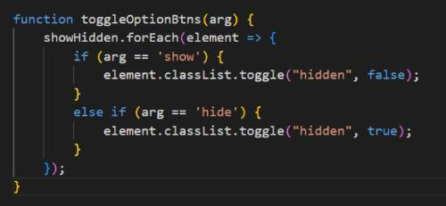
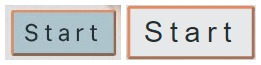
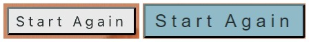
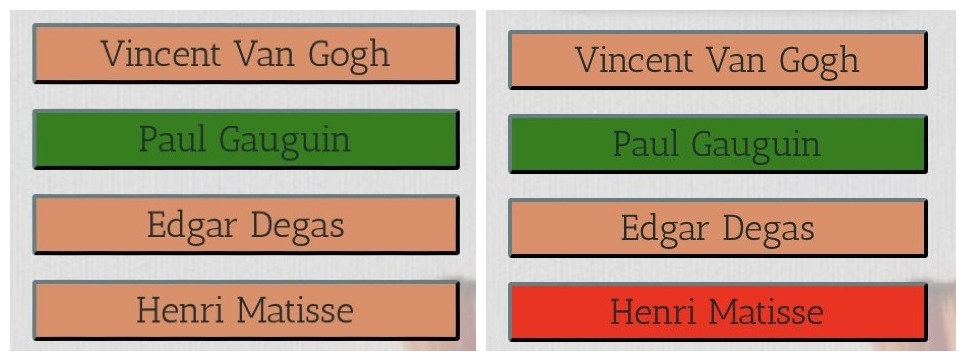
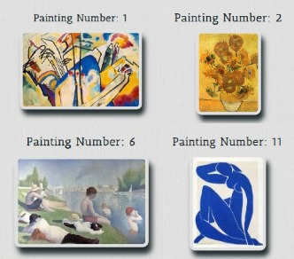

# Testing Page
## Table of Contents
 [**Testing Phase**](#testing-phase)
  * [***Bugs***](#bugs)
  * [***Validator Testing***](#validator-testing)
  * [***Accessibility Testing***](#accessibility-testing)
  * [***Manual Testing***](#manual-testing)
  * [***User Story Testing***](#user-story-testing)

## **Testing Phase:**
### **Bugs**
Bugs encountered during the development of the quiz:

  - **HTML Bugs:**
    - These errorss were encountered in the mid development of the quiz game:

      

    - The *Empty Heading* error was fixed by adding "Facts" text to the heading, which later was changed to a paragraph, as can be seen in the screenshot below.
    - Since the id of the paragrap is used to alter the message through Javascript, its contents are imperative, but needed to clear the error.

     &nbsp;&nbsp;------->&nbsp;&nbsp;

    - The *Empty Heading Error* was fixed by adding "Message" text to the heading.
    - Since the id of the heading is used to alter the message through Javascript, its contents are imperative, but needed to clear the error.

     &nbsp;&nbsp;------->&nbsp;&nbsp;

    - The *Child of Button Element Error* was fixed by removing the heading element from the text, and using the button class to style the text.
    
     &nbsp;&nbsp;------->&nbsp;&nbsp;

  - **CSS Bugs:**
    - These errorss were encountered in the mid development of the quiz game:

      
    - The first error was fixed by removing a come between two padding values.
    - The other four errors displayed, happened due to the incorrect use of a transition and transform features.
    - It was fixed in the code displayed below, by calling the transition and transform properties correctly.
      

  - **JavaScript Bugs:**
    - *Get Image Bug:* 
      
    - This bug was spotted at the final stages of the development and it was discovered that the function responsible for assigning image quantity to loop, kept trying to apply a logic on the section containing no assigned image in the array. 
    - Therefore the logic was refactored and part of the code was moved from one function to another to fix the error.
    - The process can be seen below in the screenshots.

      
      

    - Here is the final function logic, which was refactored several times to fix the current bug as well as the following bug in "Toggling Hidden".

      &nbsp;&nbsp;------->&nbsp;&nbsp;

    - Toggle Hidden Items challanges:
     - This function was refactored several times and was created to optimise the length of other functions and to simplify the task of hiding and revealing the "Facts" section and "Next" button that require hiding and revealing, the most.
     - This is how the solution looked in its first stages of development. 
       

     - Here is how the code looks now,cafter the final logic refactor, that required some experimentation. 
       

     - Get facts function is the function that is triggered by the toggle of the button.

       

### **Validator Testing**
  The final validation testing was performed when all the previously encountered bugs were fixed, and the results were of a clean code, with not errors in its final stage.

  - [W3C Markup Validation report of the quiz](https://validator.w3.org/nu/?showsource=yes&doc=https%3A%2F%2Fkirynaw.github.io%2Fart-history-quiz%2F)

    

  - [Jigsaw CSS Validation report of the quiz](https://jigsaw.w3.org/css-validator/validator?uri=https%3A%2F%2Fkirynaw.github.io%2Fart-history-quiz%2F&profile=css3svg&usermedium=all&warning=1&vextwarning=&lang=en)

    

  - JSHint JavaScript Code quality report of the quiz.

    

### **Accessibility Testing:**
To check the quiz site *Performance*, *Accessibility*, *Best Practice* and *SEO*, it was run through the *Lighthouse* Chrome Dev Tools performance statistics generator *Wave* a web accessability tool, and *DeepScan* a Javascript code quality evaluator.
There were no errors detected and the quiz has an overall high performance.
 
 - Lighthouse Desktop Report
  

 - Lighthouse Mobile Report
  

 - Wave Report on the Quiz Site:
  

- DeepScan Report on the Quiz Site:
  
  
### **Manual Testing**
 **Browser Testing** 
  - Testing was conducted across three different web browsers; *Chrome*, *Edge* and *Firefox* to ensure that the quize site works correctly on differen browsers. 
    - No issues were detected.

 **Quiz Responsiveness**
 - Responsiveness of the quiz site was tested on various Phones, Tablets, Laptops and a Desktop to check for any issues. 
    - The results confirmed that the website is fully responsive across all device screens. 
 
 **Quiz Functions and Features Performance** 
|No.| Section    |Function               | Test                                 |Pass/Fail        |
|---|------------|-----------------------|--------------------------------------|-----------------|
| 1.|Quiz Landing| When the "Start" button is clicked, it reveals: the game play section with paintings to identify; four answer options; the score box and hides the landing section| Hover over the start button, it will highlight, and then press on it. *The assigned function executes*|Pass|
|2.|Quiz Game|When the answer option button, that is clicked, contains the correct answer, the function triggered increments 1 point to the score; if wrong, no points are added|Hover over any of the four buttons, they will highlight, and choose one of the options, then press. *The assigned function executes*|Pass| 
|3. |Quiz Game|When any of the four option buttons are clicked: the buttons disable, the right answer turns green and wrong red| Hover over any of the four buttons, they will highight, then make your choice by pressing on one of them. *The assigned function executes*|Pass|
|4. |Quiz Game|When any of the option buttons are clicked, they trigger a function that reveals the "Next" button and a "Facts" paragraph|Hover over any of the four buttons, they will highlight, then press on one of the buttons. *The assigned function executes*|Pass|  
|5. |Quiz Game|When any of the option buttons are clicked again after an answer was already selected, the alert message is triggered; this event is the same on every question| Hover over any of the four buttons after having chosen an option, they will not highlight, then press on one of the buttons.  *The assigned function executes*|Pass|
|6. |Quiz Game|When the "Next" button is clicked the function is triggered, that loops randomly through stored questions; clears previously triggered functions and performs the No.2,3,4,5 functions all over again|Hover over the "Next" button, it will highlight, and press on it. *The assigned function executes*|Pass|
|7. |Quiz Game|When the 11th image in the array is reached and the "Next" button is clicked, the function condition is triggered that reveals the End Quiz Section; hides the other sections; removes the score box from heading; reveals the final score in the main section, a message and "Start Again" button|Hover over the "Next" button, it will highlight, and press on it.  *The assigned function executes.*|Pass|
|8. |Quiz End|If the final score is 3-4 points, the message is "Not Great! Maybe try again?" with sad smiley icon; if 5-8 points, the message is "Well Done! You have some knowlege in Art History" with a smiling smiley icon; if 9-10 points, the message is "Excellent! You know your Art History well.", with happy smiley icon; if 11 points, the message is "Outstanding! You are an Art History Master." with very a happy smiley icon| Go through the whole quiz and choose the names of all the 11 painting creators to reach the End Quiz Section.  *The assigned function executes.*|Pass|
|9. |Quiz End|When the "Play Again" button is clicked, it triggers the function that takes the user to the Quiz Game Section; it clears the score box and image index value to initial and restarts the loop function|Hover over the "Start Again" button, it will highlight, then press on it.  *The assigned function executes*.|Pass|

### **User Story Testing**
|No.|Story                |Pass/Fail|Evidence                     |                       |
|---|---------------------|---------|-----------------------------|-----------------------|
|1  |**As a chance visitor**   I want to be able to understand the aim of the quiz from the landing page and experience a simple interactive and visualy engaging game.   **I know I can do it when the directions are clear, visualy engaing and the game is well organised and not cluttered.**|Pass||The user starts of on a landing page which has clear, intuitive graphics, giving the user a visual comunication as well as simple text with direction of the quiz. The game is visualy rich and has intuitive and well labled navigation.|
|2  |**As a chance visitor**   I want to experience a user-friendly interface and clear navigation highlighting the quiz options; also ensuring that I can repeat the quiz easily to improve my score.   **I know I can do it when the site has visually ordered graphics, with all the buttons responding to the mouse cursor pointing at them and an easy navigation to repeat the quiz again.**|Pass||The quiz functions and visual oragnisation is ordered and on Laptops the user can use a hover feature over the buttons which hghlights them to indicate selection. On the Quiz End section the user can find a "Play Again" button that allows user to try for a better score.|
|3  |**As an fine-art history novice**   I want to be able to particiape in a quiz that gives you extra information on the art topic in question, to gain more knowlege.   **I know I can do it when there is a section in the game that pops up, presenting more information about the artist and their art.**|Pass||In the Game Section, when the user clicks on their answer selection, a paragraph with information about the painting and the artist pops up, to encourage learning.|
|4  |**As an fine-art history novice**   I want to be able to see instant feedback on the answers, to know which is right and wrong   **I can experience it when the correct answer button is chosen, it changes visually to indicate it is right and if the wrong answer is chosen it visually indicates its wrong and shows the correct one**|Pass||When the user clicks an option button containg a correct answer, the button turns green; but if the chosen answer is incorrect, the button turns red, and the correct answer is also revealed, in green.|
|4  |**As a fine-art student**   I want to engage in a quiz that incorporates images of artworks and artists, allowing for visual recognition and engagement.  **I know I can do it when the quiz is mostly visual and uses images of art work in the body of the game instead of written questions.**|Pass||The user can experience a visually rich quiz, where instead of text questions the user is presented with images of artworks; engaging their visual identification skills and give a purely visual experience.|
|6  |**As a fine-art student**,   I want to be able test my knowledge, see my progress throughout the quiz and receive an evaluation on my performance in the end.   **I know I can do it, when there is a score tracker visible throughout the game and at the end of the quiz I can see how much I scored out of total and a text feedback grading my performance.**|Pass||The user can track ther progress in the score box, located in the heading of the **Game Section** that shows a score out of 11 points.In the End Quiz Section the user receives a message and a smiley, that changes depending on the points the user scores; its text content reflects how well the user performed in the quiz.|
